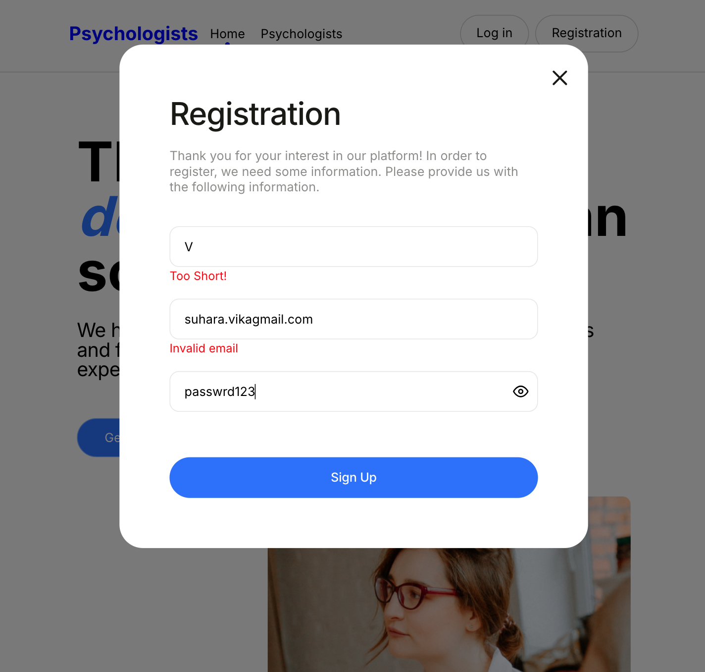
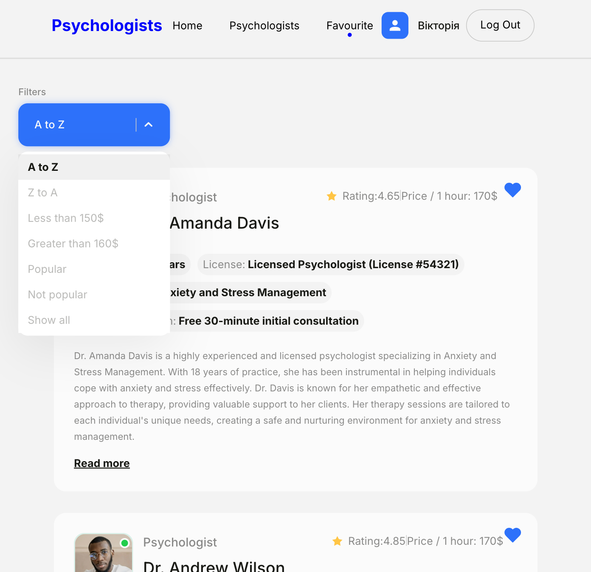
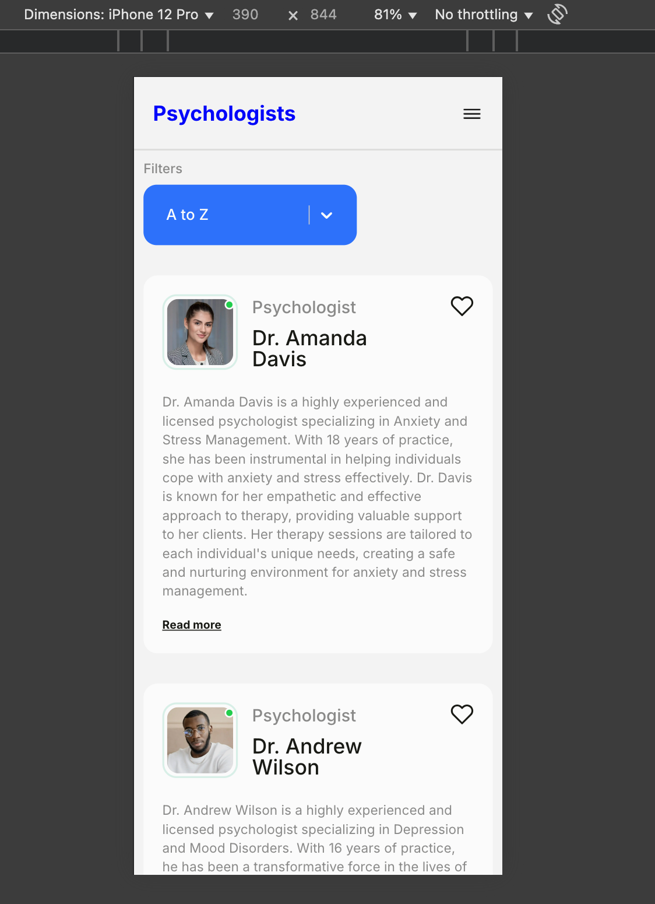

# 🧠 Psychologists App – Find and Favorite Specialists Online

A responsive web application for finding and favoriting psychologists. Includes registration, password recovery, catalog filtering, and animations for a smooth user experience.

🔗 **Live Demo**: [Psychologists App](https://vikasukhara.github.io/Psychologists/)  
📁 **Repository**: [GitHub](https://github.com/VikaSukhara/Psychologists)

---

## ✨ Features

- 🔐 Firebase Authentication (register, login, password reset)
- 📋 Psychologist catalog with filters (e.g., rating, specialty)
- ❤️ Add to Favorites (available only for logged-in users)
- 📱 Mobile and tablet responsive design
- ✨ UI animations for interactive experience

---

## 🛠 Tech Stack

- **React**  
- **React Router**  
- **Firebase Auth**  
- **JavaScript**  
- **CSS Modules**  
- **Framer Motion / AOS** (for animations)

---

## 👩‍💻 Role

I designed and developed the entire application, including:

- Firebase authentication
- Catalog filtering and routing
- Favorites logic
- Responsive, animated UI

---

## 📸 Screenshots

### 🔐 Registration Modal with Validation

User registration modal with real-time form validation.  
Invalid fields are highlighted in red, and users can toggle password visibility using the eye icon.

### ❤️ Favourites with Filter Dropdown

Displays the **Favorites** page, where logged-in users can view their saved psychologists.  
Includes a **filter dropdown** to sort by name, price, popularity, etc.

### 📱 Mobile View with Burger Menu

Fully responsive design optimized for mobile devices.  
Includes a burger menu for easy navigation and a clean layout that adapts to smaller screens.

## 📬 Contact

📧 sukhara.vikrtoiia@gmail.com  
💼 [LinkedIn](https://www.linkedin.com/in/viktoriia-sukhara-31616a288)  
📱 [Telegram](https://t.me/vika_sukhara)
